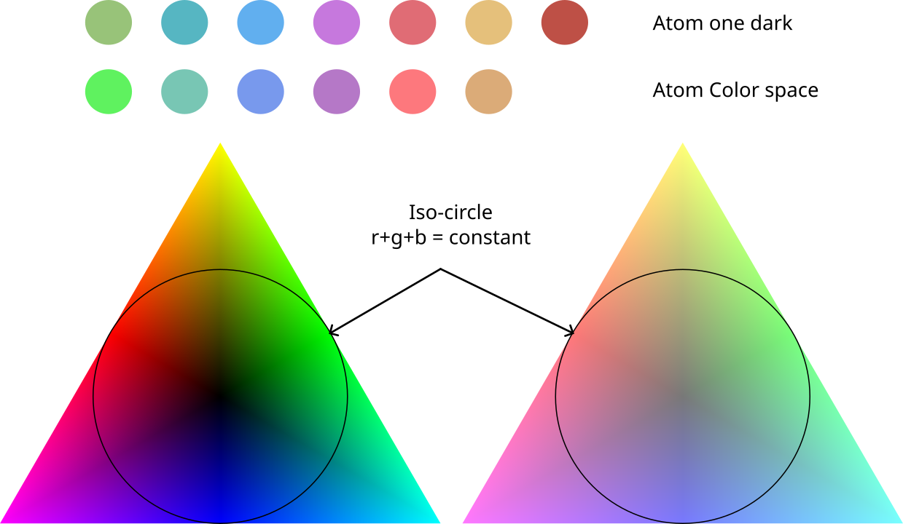

# trials-atom-one-dark-color-space

trying to find what's make atom one dark so nice

Any color combination at the same distance from the center has equivalent brightness
(brightness in terms of RGB, not in terms of perception)

